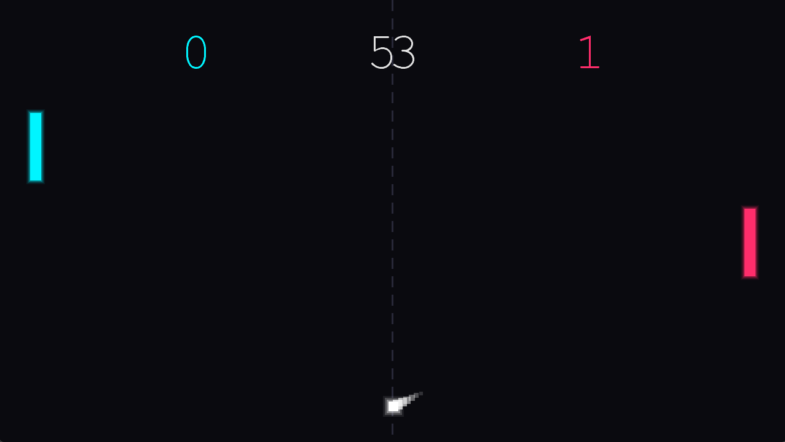

# PONG — Modern Edition

A modern take on the classic Pong game built with MonoGame and .NET 8.

## Preview


## Features
- 1v1 local multiplayer
- 60-second timed match — most points wins
- DRAW! screen on tie
- Neon aesthetic: cyan vs magenta, dark background
- Orbitron display font for titles
- Ball trail and neon glow effects on paddles and ball
- Countdown animation before each round
- Pulse effect on timer when under 5 seconds
- Background music with smooth crossfade transitions
- Keyboard controls (W/S and Up/Down arrows)
- Touch input ready for future mobile port

## Tech Stack
- MonoGame 3.8.1 / .NET 8
- C# 12
- Platform: Windows DesktopGL (Android planned)

## Controls
| Action | Keys |
| :--- | :--- |
| Move Player 1 up | W |
| Move Player 1 down | S |
| Move Player 2 up | Up Arrow |
| Move Player 2 down | Down Arrow |
| Pause (coming soon) | ESC |

## Project Structure
```text
PongGame/
├── Core/          # GameSettings, Theme, InputManager, SceneManager, AudioManager
├── Entities/      # Ball, Paddle
├── Scenes/        # IScene, MainMenuScene, GameScene
├── UI/            # Button
└── Content/
    ├── Fonts/     # DisplayFont (Orbitron), UIFont, ScoreFont (Courier New)
    └── audio/
        ├── music/ # menu_theme.wav, gameplay_theme.wav
        └── sfx/   # (future sound effects)
```

## How to Run
Prerequisites: .NET 8 SDK, MonoGame 3.8.1

```bash
dotnet restore
dotnet run
```

> [!NOTE]
> Place `Orbitron-Bold.ttf` in `Content/Fonts/` before building (download from Google Fonts — not included due to font license).

## Audio System

### Asset Structure

All audio assets live under `Content/audio/`:

```text
Content/audio/
├── music/    # Looping background tracks (WAV → compiled as Song by MGCB)
└── sfx/      # One-shot sound effects (WAV → compiled as SoundEffect by MGCB)
```

### AudioManager

`Core/AudioManager.cs` is the single point of truth for all audio playback (music and sound effects). It wraps MonoGame's `MediaPlayer` (for music) and `SoundEffect` (for one-shot clips) APIs and exposes a clean, scene-agnostic interface.

#### Responsibilities
- **Loading & caching:** Music tracks and sound effects are preloaded once during initialization and cached to avoid runtime allocation and reload latency.
- **Fades:** Automatic crossfade (400 ms) when changing music tracks.
- **Concurrent Playback:** Plays multiple sound effects simultaneously with zero glitches under rapid back-to-back hits.
- **Preventing Duplicate Music:** Requests to play the currently active music track are ignored.
- **Defensive Safeguards:** Sound effect execution is guarded against missing keys and zero volume states.

#### Volume Configuration
Volume controls are separate and support Master, Music, and SFX channels:
- **Master Volume**: Multiplier applied to all audio outputs. Default `100%` (`1.0f`).
- **Music Volume**: Multiplier applied to background music. Default `70%` (`0.7f`).
- **SFX Volume**: Multiplier applied to sound effects. Default `100%` (`1.0f`).

Effective playback volumes are:
- `Effective Music Volume = MasterVolume * MusicVolume`
- `Effective SFX Volume = MasterVolume * SfxVolume`

---

### Registered Audio Assets

#### Music Tracks
- `"menu"` — `audio/music/menu_theme`
- `"gameplay"` — `audio/music/gameplay_theme`

#### Sound Effects (SFX)
- `"paddle_hit"` — Play when the ball collides with a paddle.
- `"wall_bounce"` — Play when the ball bounces off the top/bottom walls.
- `"score"` — Play exactly once on a scoring event.
- `"button_hover"` — Play once when a menu button enters its hovered state.
- `"button_click"` — Play when a menu button is activated.

---

### Adding a New Music Track

1. Place the WAV file in `Content/audio/music/`.
2. Register it in `Content/Content.mgcb`:
   ```
   /importer:WavImporter
   /processor:SongProcessor
   /build:audio/music/your_track.wav
   ```
3. Preload it in `Game1.LoadContent`:
   ```csharp
   AudioManager.LoadTrack("mykey", "audio/music/your_track");
   ```
4. In the relevant scene's `OnEnter()`:
   ```csharp
   AudioManager.PlayTrack("mykey");
   ```

### Adding a New Sound Effect (SFX)

1. Place the WAV file in `Content/audio/sfx/`.
2. Register it in `Content/Content.mgcb`:
   ```
   /importer:WavImporter
   /processor:SoundEffectProcessor
   /build:audio/sfx/your_sfx.wav
   ```
3. Preload it in `Game1.LoadContent`:
   ```csharp
   AudioManager.LoadSfx("sfxkey", "audio/sfx/your_sfx");
   ```
4. Trigger it from code:
   ```csharp
   AudioManager.PlaySfx("sfxkey");
   ```

## Roadmap
- [x] 1v1 local multiplayer
- [x] Timed match (60 seconds)
- [x] Background music with crossfade transitions
- [ ] vs AI opponent
- [ ] Pause screen
- [ ] Sound effects (paddle hit, score, game over)
- [ ] Particle effects on score
- [ ] Android support

## Author
Diego Herrera — Fullstack Developer  
GitHub: [github.com/dherrera-software](https://github.com/dherrera-software)
